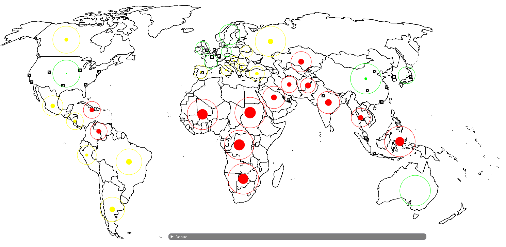
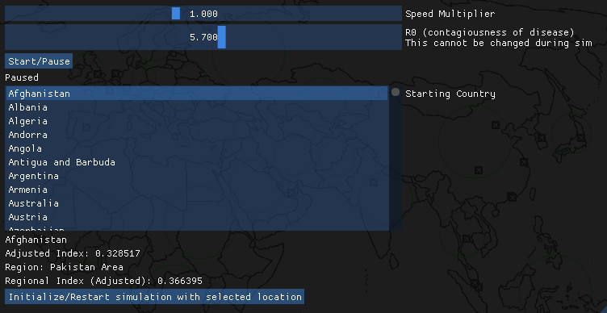

# Transmittable Disease Simulation
A C++ Project by Tejas Ambravan

### Getting Started
First thigs first, the project should be configured using cinder
and the Cinder-ImGui block.

Configuring cinder can be looked in to further
[here](https://libcinder.org/docs/guides/windows-setup/index.html)
(Cinder), and the Cinder-ImGui library can be read about
[here](https://github.com/simongeilfus/Cinder-ImGui) (ImGui)

This project also uses
[Microsoft Visual C++](https://www.microsoft.com/en-us/download/details.aspx?id=48145)
frameworks, which can be installed and configured.

Once the project is configured, just hit run and it should be
good to go! Ensure that the working directory is set as
the root directory (~/TransmittableDiseaseSimulation)
or some Image files may not load correctly.

### Controlling the UI
After the project runs, you will be greeted with
a blank world map and a user interface panel, shown below.

Before the simulation starts, use the listbox labeled "starting country"
to choose the starting country. Below the list box there will be information
about the country, including its Disease Vulnerability index,
the region it belongs to, and the regional average index. Indices
range from [.25, .75] and higher means the country is less vulnerable.

Additionally, set a value for
[R0](https://en.wikipedia.org/wiki/Basic_reproduction_number) -
R0 essentially represents the contagiousness
of a disease. It represents the expected number of cases directly generated
by a single case.

After you have chosen desired settings, press Initialize
on the bottom, and you should see a new row in the information
text area: A percentage of infections in the area selected.

When ready, press start, and watch the heatmap. Speed can be adjusted during
the sim, but R0 cannot. Click through the countries to see live updates
on their infection rates.

When the simulation is over (the counts reach a steady state),
you will see a text at the center of the screen letting you know,
and also a global infection count. Simply select a new country, adjust
R0, and initialize and you are good to go for another simulation!

### License
This is licenced under the MIT license, see [LICENCE](LICENSE) for more information.

Thank you!